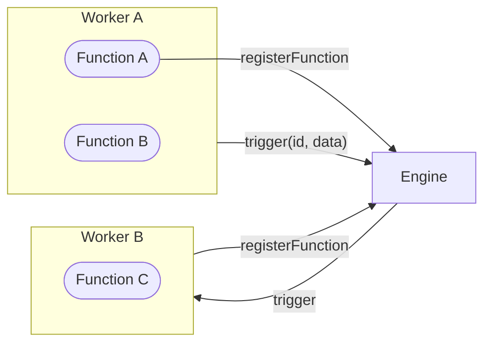

iii models every backend system with three primitives: **Function**, **Trigger**, and **Worker**. This design choice has specific motivations.

## Why Three Primitives?

Traditional backend architectures require developers to learn different abstractions for each concern: HTTP handlers, queue consumers, cron jobs, event listeners, and serverless functions all have distinct APIs and mental models. When these systems need to interact, developers must write glue code and manage cross-system concerns manually.

iii collapses this complexity by treating all executable code as Functions, all event sources as Triggers, and all processes as Workers. The engine handles routing, discovery, and coordination.

## Function

A **Function** is any unit of work that can be invoked. It receives input, performs computation, and optionally returns output.

Functions can run anywhere: locally, in the cloud, in a container, or as a third-party HTTP endpoint wrapped with iii's HTTP invocation config. The key insight is that from the engine's perspective, all functions are equivalent — they receive data, they return data, and they can invoke other functions.

This uniformity means you can swap implementations without changing callers. A function that starts as local code can become a Lambda, then a dedicated service, then a third-party API — all without modifying the functions that call it.

## Trigger

A **Trigger** binds an event source to a Function. When the event fires, the engine invokes the function.

Triggers separate the "what happens" (the function) from "when it happens" (the trigger). This separation allows the same function to respond to multiple event types: an `orders::process` function might be triggered by an HTTP POST, a queue message, or a cron schedule. The function implementation stays the same.

Built-in trigger types include HTTP, cron, queue, state changes, and streams. You can also register custom trigger types for domain-specific events.

## Worker

A **Worker** is a process that registers Functions and Triggers with the engine. Workers connect via WebSocket and remain connected for their lifetime.

Workers can be long-running services, ephemeral scripts, or anything in between. Multiple workers can register the same function ID — the engine load-balances invocations across them. This design supports horizontal scaling without explicit configuration.

<Info title="Third-Party Endpoints">
External HTTP endpoints can be registered as Functions using `HttpInvocationConfig`, but they won't have access to engine features like state or channels. The engine makes HTTP calls on their behalf but cannot extend their runtime behavior.
</Info>

## Architecture

## Ready to Dive In?

Head over to the [Functions & Triggers](/how-to/use-functions-and-triggers) HOWTO and start building
a iii powered application; or visit the [Quickstart](/quickstart) and try out a working example.

## Still want to learn more?

Check out how [Discovery](/primitives-and-concepts/discovery) works within iii and how it compares to other solutions.

<CardGroup cols={2}>
  <Card title="How to use Functions & Triggers" href="/how-to/use-functions-and-triggers" icon="book-open">
    Learn how to register functions, trigger them, and bind them to events.
  </Card>
  <Card title="Quickstart" href="/quickstart" icon="terminal">
    Follow the Quickstart and explore a live iii application.
  </Card>
</CardGroup>
