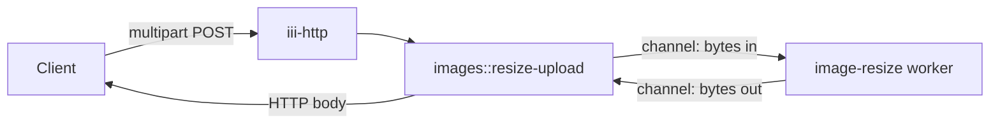

<Info title="Track 1 — Your first useful backend">
  This is tutorial **2 of 3** in Track 1. Estimated time: 20 minutes.
  Independent of Tutorial 1 — you can do them in any order.
</Info>

## What you'll build

An HTTP endpoint that accepts an image upload, resizes it via the
[`image-resize`](https://github.com/iii-hq/workers/tree/main/image-resize)
worker, and returns the resized bytes. You'll learn how **channels** move
binary payloads between workers.

## Prerequisites

- Engine running locally.
- Familiarity with `iii.registerFunction` from the
  [Quickstart](/quickstart).

## Steps

### 1. Add the workers

```bash
iii worker add iii-http
iii worker add image-resize
```

`image-resize` is a Rust worker that does EXIF-correct JPEG/PNG/WebP
resizing — scale-to-fit and crop-to-fit.

### 2. Read what image-resize exposes

{/* TODO: confirm exact function id(s) registered by image-resize.
    Likely shape: a function that accepts an input channel of bytes,
    a target width/height/mode, and writes resized bytes to an output
    channel. Verify against
    https://github.com/iii-hq/workers/tree/main/image-resize
    and link to the registered ids. */}

### 3. Write a thin glue worker

Register one function `images::resize-upload` that:

1. Receives an HTTP multipart upload (the iii-http payload exposes the
   request body / file bytes).
2. Opens an input channel and writes the upload bytes into it.
3. Invokes the image-resize function with the channel handle and target
   dimensions.
4. Reads the output channel and returns the resized bytes in the HTTP
   response.

```ts
{/* TODO: real TS skeleton — see how-to/use-channels for the channel API.
    Outline:
      iii.registerFunction('images::resize-upload', async ({ body }) => {
        const inCh  = await iii.channels.create();
        const outCh = await iii.channels.create();
        await inCh.write(body.file);
        await inCh.close();
        await iii.trigger({
          function_id: '<image-resize function id>',
          payload: { input: inCh.id, output: outCh.id, width: 256, height: 256, mode: 'fit' },
        });
        const bytes = await outCh.readAll();
        return { status_code: 200, body: bytes, headers: { 'Content-Type': 'image/jpeg' } };
      });
*/}
```

### 4. Bind the HTTP trigger

```ts
{/* TODO: registerTrigger({ type: 'http', function_id: 'images::resize-upload',
   config: { api_path: '/images/resize', http_method: 'POST' } }); */}
```

### 5. Try it

```bash
curl -X POST http://localhost:3111/images/resize \
  -F 'file=@./photo.jpg' \
  -o resized.jpg
```

{/* TODO: confirm iii-http default port and multipart body shape */}

## Result

You added image processing to your backend without choosing a library,
writing image code, or operating a separate service. The binary payload
moved through channels, not as a giant function argument.

## What you just composed



## Next steps

- [Tutorial 3 — Schedule recurring work and trace it](/tutorials/scheduled-jobs-and-observability)
- [How-to: Use channels](/how-to/use-channels) for the full channel API.
- [image-resize on GitHub](https://github.com/iii-hq/workers/tree/main/image-resize)
