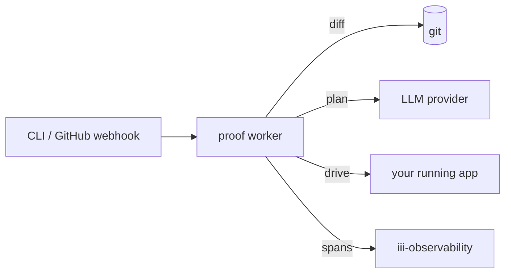

<Info title="Track 3 — iii for AI agents">
  This is tutorial **3 of 4** in Track 3. Estimated time: 20 minutes.
</Info>

## What you'll build

A continuous browser-test loop that:

1. Diffs recent changes in your repo.
2. Asks an LLM what user-visible behavior likely changed.
3. Generates a Playwright plan for those flows.
4. Runs the plan against a running version of your app.
5. Reports failures back through `iii-observability`.

You do this by adding one worker — `proof`
([source](https://github.com/iii-hq/workers/tree/main/proof)) — and
pointing it at your app.

## Prerequisites

- Engine running locally.
- A web app you can run locally (e.g. the dashboard from
  [Tutorial 6](/tutorials/realtime-dashboard)).
- An LLM API key configured for `proof`.

## Steps

### 1. Add the proof worker

```bash
iii worker add proof
```

{/* TODO: confirm whether proof requires Playwright browsers to be
    installed separately (`npx playwright install`) or installs them on
    first run. */}

### 2. Configure the target app

{/* TODO: confirm proof's config schema. Outline:
    - target_url
    - diff source (git base ref)
    - llm provider + model
    - playwright config overrides */}

```yaml
{/* TODO: real proof worker config block */}
```

### 3. Run a test pass against a diff

{/* TODO: confirm the actual function ids and trigger types proof
    registers. The README describes "diffs changes, generates test
    plans, drives Playwright" — verify whether this is invoked via:
    - a registered iii function (e.g. `proof::run`)
    - a CLI command
    - a webhook / HTTP trigger
    Update with the verified surface. */}

```bash
{/* TODO: real invocation, e.g.:
   iii trigger --function-id=proof::run --payload='{"base":"main","head":"HEAD"}'
*/}
```

`proof` will diff `main..HEAD`, ask the LLM which user flows could be
affected, generate a Playwright plan, execute it, and emit pass/fail
spans visible in `iii-observability`.

### 4. Wire it into PRs (optional)

Trigger `proof` on every PR by:

- Calling its function from a GitHub Action that uses
  [`iii trigger`](/how-to/trigger-functions-from-cli), or
- Pointing a webhook at an `iii-http` endpoint that fans out to it.

## Result

You have AI-driven browser regression coverage that re-evaluates *what
to test* on every change, instead of relying on a fixed test suite that
drifts from the code. The test agent runs as just another worker.

## What you just composed



## Next steps

- [Tutorial 10 — Durable agent memory](/tutorials/durable-agent-memory)
- [proof on GitHub](https://github.com/iii-hq/workers/tree/main/proof)
- [How-to: Observability and logs](/how-to/observability-and-logs) for
  consuming proof's traces.
