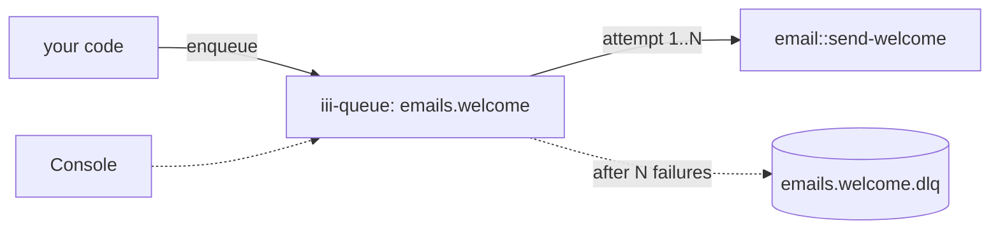

<Info title="Track 2 — Adopt iii incrementally">
  This is tutorial **2 of 3** in Track 2. Estimated time: 15 minutes.
</Info>

## What you'll build

A background job pipeline — "send a welcome email when a user signs up"
— with the same guarantees a typical job runner gives you (retries,
backoff, concurrency, DLQ), but provided by `iii-queue` rather than a
separate framework.

## Prerequisites

- Engine running locally.

## Steps

### 1. Add the queue worker

```bash
iii worker add iii-queue
```

### 2. Register the job handler

In a worker, register `email::send-welcome`. It performs the actual
side effect — for the tutorial, just log the parameters.

```ts
{/* TODO: real handler skeleton:
   iii.registerFunction('email::send-welcome', async ({ user_id }) => {
     // pretend to send an email
     console.log('sending welcome to', user_id);
     return { sent: true };
   });
*/}
```

### 3. Bind a queue trigger to the handler

```ts
{/* TODO: confirm exact registerTrigger shape for iii-queue. Outline:
   iii.registerTrigger({
     type: 'queue',
     function_id: 'email::send-welcome',
     config: {
       name: 'emails.welcome',
       max_attempts: 5,
       backoff: { strategy: 'exponential', base_ms: 500, max_ms: 30000 },
       concurrency: 4,
       dlq: 'emails.welcome.dlq',
     },
   });
*/}
```

### 4. Enqueue jobs

From any worker — or from the CLI:

```bash
{/* TODO: confirm CLI subcommand. Likely something like:
   iii trigger --function-id=queue::enqueue \
     --payload='{"queue":"emails.welcome","data":{"user_id":"u_123"}}'
*/}
```

### 5. Inspect retries and the DLQ

Cause failures by `throw`ing inside the handler for a particular
`user_id`. In the iii console you'll see:

- Per-attempt logs.
- Exponential backoff between attempts.
- The job landing in `emails.welcome.dlq` after `max_attempts`.

Use the console to redrive the DLQ once the bug is fixed.

## Result

Durable background jobs with retries and a DLQ — no Redis cluster, no
separate dashboard, no job framework to operate. Just one extra worker.

## What you just composed



## Next steps

- [Tutorial 6 — Push live updates with iii-stream](/tutorials/realtime-dashboard)
- [How-to: Use named queues](/how-to/use-named-queues)
- [How-to: Dead letter queues](/how-to/dead-letter-queues)
- [Reference: iii-queue](/workers/iii-queue)
