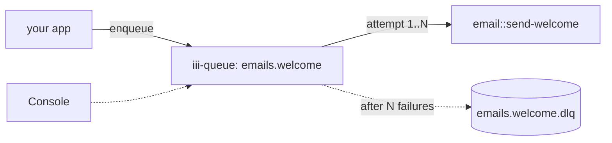

<Info title="Track 2 — Adopt iii incrementally">
  This is tutorial **2 of 3** in Track 2. Estimated time: 15 minutes.
</Info>

## What you'll build

A background job pipeline — "send a welcome email when a user signs up"
— with the same guarantees a typical job runner gives you (retries,
backoff, concurrency, DLQ), but without installing Redis-backed
infrastructure or a separate job framework.

## Prerequisites

- iii engine running.

## Steps

### 1. Add the queue worker

```bash
iii worker add iii-queue
```

### 2. Register the job handler

Register a function `email::send-welcome` in any worker (TS, Python, or
Rust). It performs the actual side effect.

{/* TODO: code stub — handler signature in TS, deliberately small (logs the email send for the tutorial) */}

### 3. Configure a named queue bound to the handler

```yaml
{/* TODO: real queue config:
  name: emails.welcome
  function_id: email::send-welcome
  concurrency: 4
  max_attempts: 5
  backoff: { strategy: exponential, base_ms: 500, max_ms: 30000 }
  dlq: emails.welcome.dlq
*/}
```

### 4. Enqueue jobs from your app

From any worker (or the CLI):

```bash
iii queue enqueue emails.welcome --data '{"user_id":"u_123"}'
```

{/* TODO: confirm exact CLI subcommand and SDK call signature for enqueue */}

### 5. Inspect retries and the DLQ

Cause a few failures (raise inside the handler for a specific user_id),
then watch the console:

- Live attempts visible per job.
- After `max_attempts` the job lands in `emails.welcome.dlq`.
- Redrive from the DLQ when fixed.

## Result

You have durable background jobs with retries and a DLQ — no Redis, no
job framework, no separate dashboard. Just one extra worker added to the
engine.

## What you just composed



## Next steps

- [Tutorial 6 — Real-time dashboard](/tutorials/realtime-dashboard)
- [How-to: Use named queues](/how-to/use-named-queues)
- [How-to: Dead letter queues](/how-to/dead-letter-queues)
- [Reference: iii-queue](/workers/iii-queue)
