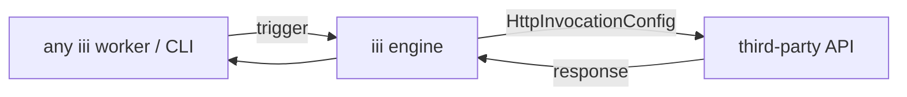

<Info title="Track 2 — Adopt iii incrementally">
  This is tutorial **1 of 3** in Track 2. Estimated time: 15 minutes.
</Info>

## What you'll build

Take a third-party HTTP API — say `GET https://api.example.com/v1/orders/:id`
— and register it as an iii function (`legacy::orders::get`) using iii's
**HTTP-invoked function** pattern. After this, any worker can call it
with `iii.trigger({ function_id: 'legacy::orders::get', payload: ... })`
just like a native function.

The point: you do **not** write a glue worker that wraps `fetch()`. You
declare the endpoint and iii does the call.

<Note>
  This is `registerFunction(meta, HttpInvocationConfig)` — outbound HTTP.
  It is the inverse of `registerTrigger({ type: 'http' })`, which lets
  iii **receive** inbound HTTP. Don't confuse them.
</Note>

## Prerequisites

- Engine running locally.
- Any HTTP API you can call (use `https://httpbin.org` to follow along
  without credentials).

## Steps

### 1. Create a worker

Scaffold a small SDK worker in TS, Python, or Rust. No extra registry
workers are required.

### 2. Register the external endpoints

Define a small map of `{ path, id, method }` and loop over it,
calling `registerFunction` with an `HttpInvocationConfig`:

```ts
{/* TODO: real TS skeleton — confirm exact API signature against
    references/http-invoked-functions.js. Outline:

    const base = 'https://api.example.com/v1';
    const endpoints = [
      { id: 'legacy::orders::get',    path: '/orders/:id', method: 'GET' },
      { id: 'legacy::orders::create', path: '/orders',     method: 'POST' },
    ];

    for (const e of endpoints) {
      iii.registerFunction(
        { id: e.id },
        { url: base + e.path, method: e.method,
          auth: { type: 'bearer', token_key: 'EXAMPLE_API_TOKEN' } }
      );
    }
*/}
```

<Tip>
  Pass auth as **env var names**, not raw secrets. The worker reads the
  variable at invocation time.
</Tip>

### 3. Invoke from anywhere

From any other worker, or from the CLI:

```bash
iii trigger --function-id='legacy::orders::get' --payload='{"id":"o_123"}'
```

iii performs the HTTP call. Non-2xx responses surface as invocation
failures (so retries, DLQs, and conditions all apply naturally).

### 4. Compose with other workers

Because the endpoint is now just a function, you can put a queue in
front of it for retries, a cron trigger above it for polling, or chain
it into a pipeline — without changing the original service.

```ts
{/* TODO: example showing iii-queue handler bound to legacy::orders::get
    so failed calls retry with backoff. */}
```

## Result

You integrated a third-party API without writing a glue worker, without
calling `fetch()` yourself, and without changing the service. Every
iii primitive (queues, conditions, traces, retries) now applies to it.

## What you just composed



## Next steps

- [Tutorial 5 — Background jobs with iii-queue](/tutorials/background-jobs-without-a-runner):
  add retries to the wrapped endpoint.
- [How-to: Define request/response formats](/how-to/define-request-response-formats)
  to give the wrapped function a typed schema.
- The `iii-http-invoked-functions` skill in `skills/references/` has
  reference implementations in TS, Python, and Rust.
