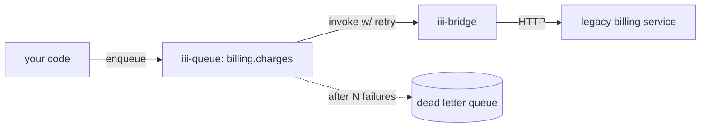

<Info title="Track 2 — Adopt iii incrementally">
  This is tutorial **1 of 3** in Track 2. Estimated time: 20 minutes.
</Info>

## What you'll build

You have an existing service — say, an internal billing API at
`https://billing.internal/charges`. You want to call it from new code
through iii so you get discovery, tracing, and retry semantics — without
modifying the service.

You'll use:

- `iii-bridge` — exposes external HTTP endpoints as iii functions.
- `iii-queue` — wraps the bridged function so failures retry with
  backoff.

## Prerequisites

- iii engine running.
- Any HTTP service you can call (use `https://httpbin.org` if you don't
  have one handy).

## Steps

### 1. Add the bridge worker

```bash
iii worker add iii-bridge
```

### 2. Declare the external endpoint as an iii function

```yaml
{/* TODO: real iii-bridge config — maps an outbound URL to a function id like `billing::charge`.
   Include: method, url template, header passthrough, auth env var. */}
```

After this, any worker can call `iii.invoke('billing::charge', payload)`
and the bridge will perform the HTTP request.

### 3. Try a direct invocation

```bash
iii trigger billing::charge --data '{"amount":100,"customer":"cus_123"}'
```

{/* TODO: confirm the exact CLI command — see how-to/trigger-functions-from-cli */}

### 4. Add a queue in front for retries

```bash
iii worker add iii-queue
```

Wire a named queue `billing.charges` whose handler is `billing::charge`
with a retry policy. Now upstream code enqueues instead of invoking
directly.

```yaml
{/* TODO: queue config — name, max_attempts, backoff strategy, DLQ binding */}
```

### 5. Verify retry behavior

Point the bridge at a URL that returns 503 the first 2 times, then 200.
Enqueue once. Confirm the queue retried twice and succeeded on the third
attempt (visible in the console traces).

## Result

You now call a legacy service through iii with the same ergonomics as a
native function — plus observability and retries — and the legacy service
is unmodified.

## What you just composed



## Next steps

- [Tutorial 5 — Background jobs without a job runner](/tutorials/background-jobs-without-a-runner)
- [Reference: iii-bridge](/workers/iii-bridge)
- [How-to: Dead letter queues](/how-to/dead-letter-queues)
