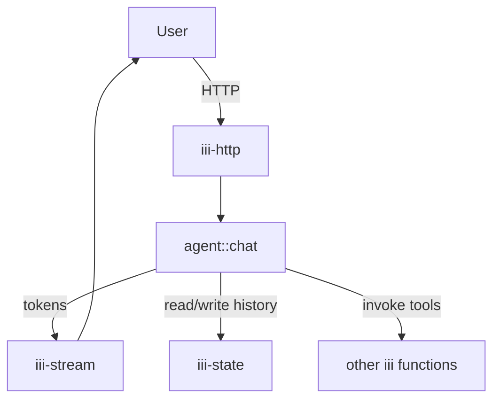

<Info title="Track 3 — iii for AI agents">
  This is tutorial **2 of 4** in Track 3. Estimated time: 30 minutes.
  Builds on [Tutorial 7](/tutorials/expose-functions-as-mcp-tools).
</Info>

## What you'll build

A worker that *is* an agent — not just a tool surface for an external
agent. The agent worker:

1. Receives a user message via HTTP or a queue.
2. Calls an LLM provider with the iii function catalog as available
   tools.
3. Executes tool calls by invoking other iii functions.
4. Persists conversation history in `iii-state`.
5. Streams tokens back to the caller via `iii-stream`.

## Prerequisites

- iii engine running.
- An LLM API key (OpenAI, Anthropic, or any provider you prefer).
- Workers from earlier tutorials registered (so the agent has tools to
  call).

## Steps

### 1. Add the workers the agent needs

```bash
iii worker add iii-state
iii worker add iii-stream
iii worker add iii-http
```

### 2. Register the agent function

Create a worker that registers `agent::chat`. Inside the handler:

{/* TODO: code skeleton (TS or Python) showing:
   - read `conversations/{session_id}` from iii-state
   - call LLM with messages + tool catalog (built from iii.listFunctions filtered by tag)
   - if tool_calls: iii.invoke(tool.id, tool.args), append to messages, loop
   - stream tokens via iii-stream channel `agent.tokens.{session_id}`
   - persist updated conversation back to iii-state
*/}

### 3. Build the tool catalog from iii itself

Iterate the engine's function registry, keep only functions tagged
`agent.tool`, and convert each to your LLM's tool schema.

{/* TODO: code stub — listFunctions + filter + map to OpenAI/Anthropic tool format */}

<Tip>
  Reuse the `mcp.expose` tag from [Tutorial 7](/tutorials/expose-functions-as-mcp-tools)
  if you want the same set of tools to be available to both your custom
  agent and external MCP clients.
</Tip>

### 4. Wire HTTP and stream triggers

```yaml
{/* TODO: HTTP trigger POST /agent/chat → agent::chat
   plus stream binding agent.tokens.{session_id} for SSE/WebSocket consumers */}
```

### 5. Try it

```bash
curl -N -X POST http://localhost:PORT/agent/chat \
  -d '{"session_id":"s1","message":"add a todo to ship the docs"}'
```

You should see tokens stream back, and a new entry appear via
`todos::create`.

## Result

You built an agent that uses your entire iii backend as its toolbox.
Adding a new tool means registering a new function — no agent code
changes.

## What you just composed



## Next steps

- [Tutorial 9 — AI-driven browser tests](/tutorials/ai-driven-browser-tests):
  a ready-made agent worker (`proof`).
- [Tutorial 10 — Durable agent memory](/tutorials/durable-agent-memory):
  add scheduled reflection and long-term memory.
- The [`iii-agentic-backend` skill](https://github.com/iii-hq/iii)
  collects agent-orchestration patterns.
