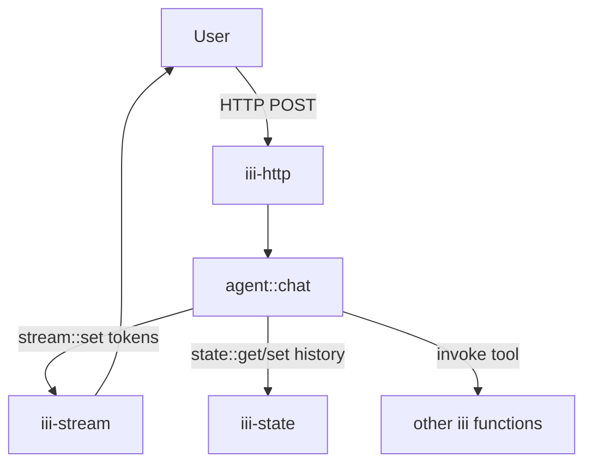

<Info title="Track 3 — iii for AI agents">
  This is tutorial **2 of 4** in Track 3. Estimated time: 30 minutes.
  Builds on [Tutorial 7](/tutorials/expose-functions-as-mcp-tools).
</Info>

## What you'll build

A worker that *is* an agent — not just a tool surface for an external
agent. The agent worker:

1. Receives a user message via HTTP.
2. Calls an LLM provider with the iii function catalog as available
   tools.
3. Executes tool calls by invoking other iii functions through the
   engine.
4. Persists conversation state in `iii-state`.
5. Streams tokens back to the caller via `iii-stream`.

## Prerequisites

- Engine running locally.
- An LLM API key.
- Workers from earlier tutorials registered (so the agent has tools to
  call). Anything you registered for [Tutorial 7](/tutorials/expose-functions-as-mcp-tools)
  is fair game.

## Steps

### 1. Add the supporting workers

```bash
iii worker add iii-state
iii worker add iii-stream
iii worker add iii-http
```

### 2. Build the tool catalog from iii itself

Iterate the engine's function registry, keep only functions you want
the agent to use, and convert each to your LLM's tool schema.

{/* TODO: confirm the function-listing API. Likely something like:
    const fns = await iii.trigger({ function_id: 'engine::list_functions' });
    Then filter by metadata/tag and map to OpenAI/Anthropic tool format. */}

<Tip>
  Reuse the opt-in convention from
  [Tutorial 7](/tutorials/expose-functions-as-mcp-tools) so the same
  set of tools is available to your custom agent and to external MCP
  clients.
</Tip>

### 3. Register the agent function

```ts
{/* TODO: code skeleton:
   iii.registerFunction('agent::chat', async ({ session_id, message }) => {
     const history = (await iii.trigger({
       function_id: 'state::get',
       payload: { scope: 'agent.chats', key: session_id },
     })) ?? [];
     history.push({ role: 'user', content: message });

     while (true) {
       const resp = await llm.chat(history, { tools: catalog,
         on_token: (t) => iii.trigger({
           function_id: 'stream::set',
           payload: { stream: 'agent.tokens', group: session_id,
                      id: ulid(), data: { delta: t } },
         }),
       });
       history.push(resp.message);
       if (!resp.tool_calls?.length) break;
       for (const tc of resp.tool_calls) {
         const out = await iii.trigger({ function_id: tc.id, payload: tc.args });
         history.push({ role: 'tool', tool_call_id: tc.tc_id, content: JSON.stringify(out) });
       }
     }

     await iii.trigger({
       function_id: 'state::set',
       payload: { scope: 'agent.chats', key: session_id, value: history },
     });
     return { ok: true };
   });
*/}
```

### 4. Wire HTTP entry and stream output

```ts
{/* TODO: HTTP trigger POST /agent/chat → agent::chat
    plus instructions for clients to subscribe to
    ws://host/stream/agent.tokens/{session_id}/ for token deltas. */}
```

### 5. Try it

```bash
curl -X POST http://localhost:3111/agent/chat \
  -d '{"session_id":"s1","message":"create a note titled ship the docs"}'
```

In a browser tab subscribed to the `agent.tokens/s1` stream, you'll see
tokens stream in. The note function gets invoked as a tool call.

## Result

You built an agent that uses your entire iii backend as its toolbox.
Adding a new tool means registering a new function — no agent code
changes.

## What you just composed



## Next steps

- [Tutorial 9 — AI-driven browser tests](/tutorials/ai-driven-browser-tests):
  a ready-made agent worker (`proof`).
- [Tutorial 10 — Durable agent memory](/tutorials/durable-agent-memory):
  add scheduled reflection and long-term memory.
