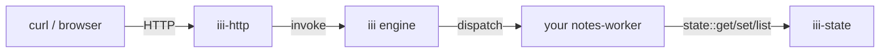

<Info title="Track 1 — Your first useful backend">
  This is tutorial **1 of 3** in Track 1. Estimated time: 25 minutes.
</Info>

## What you'll build

A CRUD worker for a domain you care about (this tutorial uses **notes**;
swap in whatever you want). You'll:

1. Read [`todo-worker`](https://github.com/iii-hq/workers/tree/main/todo-worker)
   as a reference — it shows the shape of a CRUD worker against `iii-state`.
2. Write your own worker that registers `notes::list`, `notes::create`,
   `notes::update`, `notes::delete`.
3. Add `iii-state` for persistence and `iii-http` for routing.

<Note>
  `todo-worker` in the registry is a **sample** to learn from, not a
  drop-in CRUD service. The point of iii is that *you* write the
  Functions; this tutorial shows you the pattern.
</Note>

## Prerequisites

- Engine running locally ([Install](/install)).
- You completed the [Quickstart](/quickstart).

## Steps

### 1. Read the reference sample

```bash
git clone https://github.com/iii-hq/workers
cd workers/todo-worker
```

Skim the worker source. Notice the shape:

- One `iii.registerFunction(id, handler)` call per CRUD operation.
- Handlers use `iii.trigger({ function_id: 'state::get' | 'state::set' | 'state::list' })` for storage.
- HTTP triggers are declared with `iii.registerTrigger({ type: 'http', ... })`.

{/* TODO: link to the exact files / line ranges in todo-worker that
    illustrate each of these — list/create/update/delete handlers and
    the HTTP trigger block. */}

### 2. Scaffold your own worker

In a new project directory:

```bash
iii init
iii worker add ./workers/notes-worker
```

{/* TODO: confirm the exact `iii init` and `iii worker add ./path` flow
    against the current CLI. Quickstart shows `iii create --template`. */}

### 3. Add the workers your CRUD needs

```bash
iii worker add iii-state
iii worker add iii-http
```

### 4. Register the CRUD functions

In `workers/notes-worker/src/worker.ts`:

```ts
{/* TODO: real TS skeleton matching todo-worker's pattern:
   iii.registerFunction('notes::list', async () => {
     return await iii.trigger({ function_id: 'state::list', payload: { scope: 'notes' } });
   });
   iii.registerFunction('notes::create', async ({ body }) => {
     const id = crypto.randomUUID();
     await iii.trigger({ function_id: 'state::set', payload: { scope: 'notes', key: id, value: body } });
     return { id, ...body };
   });
   // ... update, delete
*/}
```

### 5. Bind HTTP triggers

```ts
{/* TODO: registerTrigger blocks for:
     POST   /notes        → notes::create
     GET    /notes        → notes::list
     PATCH  /notes/:id    → notes::update
     DELETE /notes/:id    → notes::delete
   Use api_path with leading slash. */}
```

### 6. Run it

```bash
curl -X POST http://localhost:3111/notes \
  -H 'Content-Type: application/json' \
  -d '{"title":"buy milk"}'

curl http://localhost:3111/notes
```

{/* TODO: confirm iii-http default port; quickstart shows 3111 */}

## Result

You wrote a worker — not installed someone else's. You learned the
"register a function per operation, persist via `state::set`, expose via
HTTP triggers" pattern that every other iii worker follows.

## What you just composed



## Next steps

- [Tutorial 2 — Resize images on the way through](/tutorials/add-image-uploads)
- [How-to: Use functions and triggers](/how-to/use-functions-and-triggers)
- [Reference: iii-state](/workers/iii-state) and
  [iii-http](/workers/iii-http).
