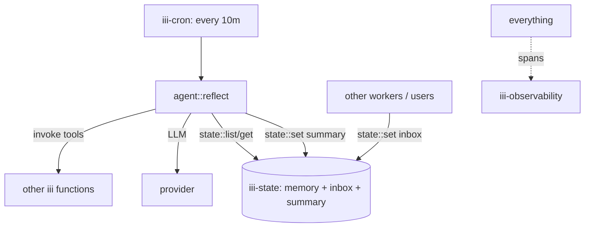

<Info title="Track 3 — iii for AI agents">
  This is tutorial **4 of 4** in Track 3. Estimated time: 30 minutes.
  Builds on [Tutorial 8](/tutorials/build-a-tool-using-agent).
</Info>

## What you'll build

A long-running agent that:

- Stores observations in `iii-state` (durable memory).
- Wakes up on a cron schedule to **reflect** — summarize recent
  observations, prune low-value memories, decide what to do next.
- Acts autonomously by invoking other iii functions.

This is the substrate pattern for "always-on" agents: assistants that
keep working between user messages.

## Prerequisites

- Completed [Tutorial 8](/tutorials/build-a-tool-using-agent) (or
  another working agent worker).

## Steps

### 1. Add the supporting workers

```bash
iii worker add iii-state
iii worker add iii-cron
iii worker add iii-observability
```

### 2. Model agent memory in iii-state

Pick a keyspace layout. A simple split:

| Key pattern | Purpose |
|---|---|
| `agents/{id}/profile` | Stable identity, goals, constraints |
| `agents/{id}/memory/{ulid}` | Append-only observations |
| `agents/{id}/summary` | Compacted long-term summary |
| `agents/{id}/inbox/{ulid}` | Pending messages / events to react to |

```ts
{/* TODO: skeleton for appending an observation:
   await iii.trigger({
     function_id: 'state::set',
     payload: {
       scope: `agents/${id}/memory`,
       key: ulid(),
       value: { ts: Date.now(), source, text },
     },
   });
*/}
```

### 3. Register the reflection function

```ts
{/* TODO: code skeleton for agent::reflect handler:
   1. List state under agents/{id}/memory and agents/{id}/inbox
   2. Read the existing summary
   3. Call the LLM with summary + recent items, asking for an updated
      summary and an action list
   4. Persist the new summary
   5. For each action, iii.trigger() the relevant function
*/}
```

### 4. Schedule reflection

```ts
{/* TODO: registerTrigger:
   iii.registerTrigger({
     type: 'cron',
     function_id: 'agent::reflect',
     config: { expression: '0 *\/10 * * * * *' }, // every 10 minutes
   });
*/}
```

### 5. Feed the agent

Have other workers or external systems append to the agent's inbox:

```bash
iii trigger --function-id=state::set --payload='{
  "scope":"agents/a1/inbox","key":"<ulid>",
  "value":{"source":"slack","text":"new ticket #123"}
}'
```

The next reflection tick incorporates the message and decides what to
do with it.

### 6. Watch it think

In the iii console, every reflection tick produces a trace:
`cron:tick → agent::reflect → (LLM) → tool calls`.

## Result

An autonomous agent with durable memory and a heartbeat. State persists
across restarts (it lives in `iii-state`), it acts without needing a
user prompt (cron drives it), and every action is observable.

## What you just composed



## Where to go from here

- Combine with [Tutorial 7](/tutorials/expose-functions-as-mcp-tools) so
  a human can also drive the same agent through Claude or Cursor.
- [Reference: iii-state](/workers/iii-state) and
  [iii-cron](/workers/iii-cron).
- [How-to: React to state changes](/how-to/react-to-state-changes) for
  event-driven (rather than scheduled) reflection.
