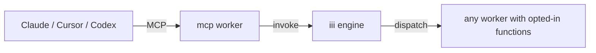

<Info title="Track 3 — iii for AI agents">
  This is tutorial **1 of 4** in Track 3. Estimated time: 15 minutes.
  This is the **hero tutorial** of the AI track — every iii function in
  your project becomes an agent tool with no MCP server code.
</Info>

## What you'll build

Take any iii function you've already registered and expose it as an MCP
tool that Claude Desktop, Cursor, Codex, or any MCP client can call.

The `mcp` worker
([source](https://github.com/iii-hq/workers/tree/main/mcp)) is a Rust
binary exposing a Model Context Protocol surface — both stdio and HTTP
JSON-RPC. It pulls function definitions from the engine and presents
them as MCP tools.

## Prerequisites

- Engine running locally with at least one registered function (e.g.
  the worker from [Tutorial 1](/tutorials/crud-api-in-10-minutes)).
- An MCP-capable client (Claude Desktop, Cursor, or any MCP client).

## Steps

### 1. Add the mcp worker

```bash
iii worker add mcp
```

### 2. Mark which functions to expose

The mcp worker only surfaces functions that opt in. Tag the registrations
you want exposed.

{/* TODO: confirm the actual opt-in mechanism. The README mentions
    functions "tagged mcp.expose". Verify whether this is:
    - a metadata key in registerFunction({ metadata: { mcp: { expose: true }}})
    - a tags array
    - a config field on the mcp worker that lists function ids
    Update this section with the real shape and an example for TS,
    Python, and Rust. */}

```ts
{/* TODO: real registerFunction example with whatever the opt-in
    convention turns out to be. */}
```

<Tip>
  The function's input/output schema becomes the MCP tool schema
  automatically. Write good schemas (see
  [Define request/response formats](/how-to/define-request-response-formats))
  — agents read them as tool documentation.
</Tip>

### 3. Connect an MCP client

**Claude Desktop / Cursor (stdio):**

```json
{/* TODO: real claude_desktop_config.json snippet pointing at the mcp
    worker binary or `iii worker run mcp --stdio` (verify command). */}
```

**Any client (HTTP JSON-RPC):**

```bash
{/* TODO: confirm command to start mcp in HTTP mode and the default
    port. */}
```

### 4. Use the tool

In your MCP client, ask: *"Create a note titled 'ship the docs'."* The
agent should discover the matching function, call it, and report the
result.

## Result

Every iii function you opted in is now an agent tool. You wrote no MCP
server code. New functions added to any worker show up immediately
because of iii's live discovery.

## What you just composed



## Next steps

- [Tutorial 8 — Build a tool-using agent worker](/tutorials/build-a-tool-using-agent):
  build the agent side, not just the tool side.
- [mcp worker on GitHub](https://github.com/iii-hq/workers/tree/main/mcp)
- [How-to: Define request/response formats](/how-to/define-request-response-formats)
  — schemas matter for MCP tool quality.
