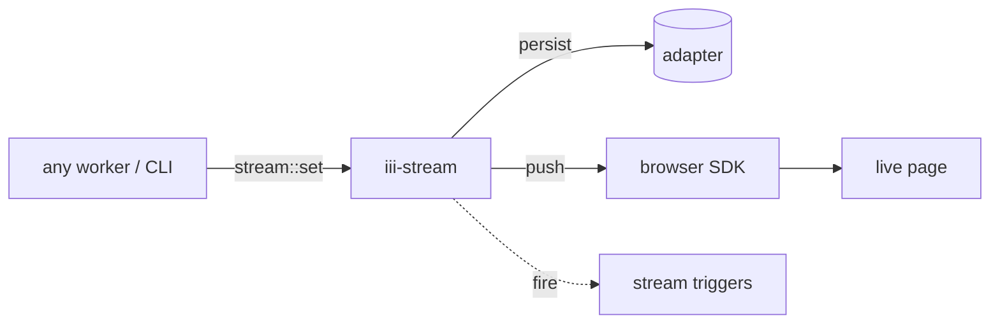

<Info title="Track 2 — Adopt iii incrementally">
  This is tutorial **3 of 3** in Track 2. Estimated time: 25 minutes.
</Info>

## What you'll build

A live "orders" page that updates in real time. The pattern is one
call: `stream::set` persists the data, broadcasts it to every browser
subscribed to the stream, **and** fires any registered `stream`
triggers — all in one operation.

Streams are organized as `stream_name > group_id > item_id`. Clients
subscribe at the group level by connecting to
`ws://host/stream/{stream_name}/{group_id}/`.

## Prerequisites

- Engine running locally.
- A simple frontend (Vite + React or plain HTML).

## Steps

### 1. Add the stream worker

```bash
iii worker add iii-stream
```

### 2. Publish updates from any worker

Anywhere your code learns about a new or updated order, call
`stream::set` with the stream, group, and item identifiers:

```ts
{/* TODO: confirm exact stream::set payload shape against
    docs/workers/iii-stream.mdx. Outline:
    await iii.trigger({
      function_id: 'stream::set',
      payload: {
        stream: 'orders',
        group: 'global',
        id: order.id,
        data: order,
      },
    });
*/}
```

That single call:

1. Persists the item via the configured adapter (Redis or KvStore).
2. Pushes the update to every WebSocket client subscribed to
   `orders/global`.
3. Fires any registered `stream` triggers (so you can react in another
   worker too, if you want).

### 3. Subscribe from the browser

Install the browser SDK:

```bash
pnpm add iii-browser-sdk
```

Open a stream subscription:

```ts
{/* TODO: confirm exact iii-browser-sdk subscription API. Outline:
    import { IIIBrowser } from 'iii-browser-sdk';
    const iii = new IIIBrowser({ url: 'ws://localhost:3112' });
    iii.streams.subscribe('orders', 'global', (event) => {
      updateUI(event.data);
    });
*/}
```

{/* TODO: confirm iii-stream default port from docs/workers/iii-stream.mdx
    (sample shows 3112) */}

### 4. Drive a change

Trigger an order update from anywhere:

```bash
iii trigger --function-id=stream::set --payload='{
  "stream":"orders","group":"global","id":"o_123",
  "data":{"status":"paid","total":4200}
}'
```

The browser updates within milliseconds, and the persisted value is
available the next time a client subscribes (replay from the adapter).

## Result

A real-time UI without a WebSocket server, without a pub/sub broker,
without a state-trigger middleman, and with persistence built in. One
worker added; one function call to publish.

## What you just composed



## Next steps

- [Track 3 — iii for AI agents](/tutorials/expose-functions-as-mcp-tools)
- [How-to: Stream realtime data](/how-to/stream-realtime-data)
- [How-to: Use iii in the browser](/how-to/use-iii-in-the-browser)
- [Reference: iii-stream](/workers/iii-stream) for groups, adapters,
  and trigger config.
