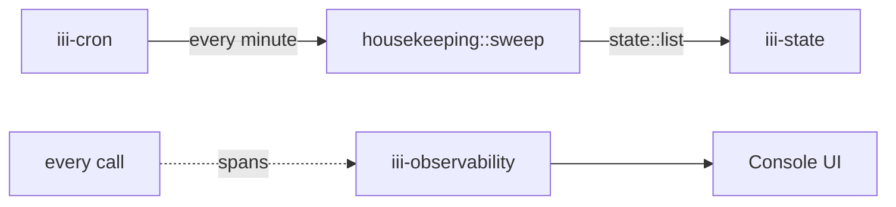

<Info title="Track 1 — Your first useful backend">
  This is tutorial **3 of 3** in Track 1. Estimated time: 15 minutes.
  Independent of Tutorials 1 and 2.
</Info>

## What you'll build

A small worker that registers a `housekeeping::sweep` function. You'll
trigger it every minute with `iii-cron`, and watch every invocation as
a distributed trace via `iii-observability`.

## Prerequisites

- Engine running locally.

## Steps

### 1. Add the workers

```bash
iii worker add iii-state
iii worker add iii-cron
iii worker add iii-observability
```

### 2. Register the function

In a worker file (TS or Python), register a tiny handler that lists a
state scope and does something with each entry:

```ts
{/* TODO: real TS skeleton, e.g.:
   iii.registerFunction('housekeeping::sweep', async () => {
     const items = await iii.trigger({
       function_id: 'state::list',
       payload: { scope: 'jobs' },
     });
     // For each entry, decide whether to keep or delete based on age.
     // Return a small summary so it shows up in traces.
     return { scanned: items.length };
   });
*/}
```

### 3. Bind a cron trigger

`iii-cron` uses 7-field expressions: `sec min hour dom month dow year`.

```ts
{/* TODO: registerTrigger skeleton:
   iii.registerTrigger({
     type: 'cron',
     function_id: 'housekeeping::sweep',
     config: { expression: '0 * * * * * *' }, // every minute
   });
*/}
```

### 4. Watch the traces

Open the iii console:

```bash
iii console
```

After the first tick (≤ 60 seconds) you'll see a span tree:

```
cron:tick → housekeeping::sweep → state::list
```

`iii-observability` records every function call and trigger fire, so
the entire pipeline is observable without any extra instrumentation.

## Result

You scheduled work without installing a scheduler, and you have
distributed tracing without configuring OpenTelemetry. Both are workers
you added with one command each.

## What you just composed



## Next steps

- [Track 2 — Adopt iii incrementally](/tutorials/bridge-existing-api)
- [How-to: Schedule a cron task](/how-to/schedule-cron-task)
- [How-to: Observability and logs](/how-to/observability-and-logs)
- [Reference: iii-cron](/workers/iii-cron) and
  [iii-observability](/workers/iii-observability).
