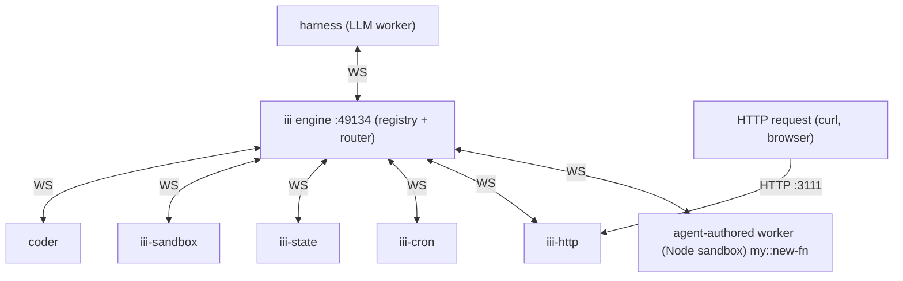

# When to use

Read this before authoring a worker. The TypeScript surface
(`registerWorker` / `registerFunction` / `registerTrigger` / etc.)
makes sense only once the four primitives below are clear in your
head — otherwise every snippet in [`iii://iii/authoring`](iii://iii/authoring)
will read like an arbitrary API call instead of the obvious thing.

# The four pieces

Every iii system is exactly these four things:

| Primitive | What it is                                                                | Owned by              |
|-----------|---------------------------------------------------------------------------|-----------------------|
| Engine    | The single coordinator process. Routes every invocation.                  | The operator (one).   |
| Worker    | A process that opens a WebSocket to the engine.                           | Anyone who writes one.|
| Function  | A named handler inside a worker, identified `service::name`.              | The worker that registers it. |
| Trigger   | A `(type, config, function_id)` triple that causes a function to run.     | A worker (the type) + a caller (the binding). |

There is nothing else. No mailboxes, no service discovery DNS, no
sidecar — just workers opening sockets to one engine and naming the
handlers they expose.

# Engine

The engine is a single process (the `iii-worker-manager` worker,
listening on port `49134` by default — see
[`config.yaml`](config.yaml) line 1-4). It holds:

- The live registry of every connected worker.
- The live registry of every function those workers expose.
- The live registry of every trigger bound to a function.

When a worker connects, the engine records what it provides. When a
worker disconnects, the engine drops its functions from the registry,
cancels any in-flight invocations of those functions (callers receive
an `invocation_stopped` error, not a timeout), and notifies the rest
of the system that the topology changed.

Routing is the engine's only job. It does not execute application
code. It does not know whether `users::get` is implemented in Node, in
Rust, in a microVM, or in a browser tab — it just knows *some*
worker provides it right now and routes the next invocation there.

# Worker

A worker is any process that opens a WebSocket to the engine and
identifies itself. After the handshake it can do three things:

1. Register Functions (`registerFunction`).
2. Register Triggers (`registerTrigger` to bind an existing trigger type to one of its functions, `registerTriggerType` to publish a new trigger type other workers can bind to).
3. Invoke other workers' Functions (`trigger`).

A worker doesn't have to do all three. A pure-producer worker only
registers functions. A pure-caller worker only triggers. Most real
workers do a mix.

Workers transition through a small state machine:

```
connecting → connected → available / busy → disconnected
```

`connecting` is the WebSocket handshake. `connected` means the engine
has the worker in its registry. `available` / `busy` describe whether
the worker is currently handling an invocation. `disconnected` is
terminal for that socket; the worker can reconnect, but the engine
treats it as a fresh registration when it does.

Workers can be persistent (long-running daemons like `iii-http`,
`database`) or ephemeral (one-shot processes that register, do their
work, call `shutdown()`, and exit). Both are first-class.

# Function

A Function is a handler with an id of the form `service::name`. The
`::` is the namespace separator and the convention is purely
organisational — the engine treats `database::query` and
`my-thing::frobnicate` as opaque keys.

The handler takes a payload and returns a result. The same handler
signature is used regardless of how the invocation arrived: a direct
`iii.trigger` call from another worker, an HTTP request that hit
`iii-http`'s webhook trigger, a cron tick from `iii-cron`, a queue
message — they all materialise at the handler as `(payload) => result`.

Function ids are **stable across worker restarts**. When the worker
hosting `users::get` crashes and restarts, callers don't need to
know — they keep invoking `users::get`, and the engine routes the
next call to whichever worker currently provides it. This is what
makes the function id the only contract that matters between workers.

# Trigger

A Trigger has three parts:

- **type** — the kind of event source (`http`, `cron`, anything a worker has published).
- **config** — what `type`-specific parameters to listen with (which URL path, which cron expression, which queue name).
- **function_id** — which Function to invoke when the event fires.

Trigger types are themselves provided by workers:

| Trigger type    | Worker that owns it |
|-----------------|---------------------|
| `http`          | [`iii-http`](https://workers.iii.dev/workers/iii-http.md) |
| `cron`          | [`iii-cron`](https://workers.iii.dev/workers/iii-cron.md) |
| `<your-type>`   | A worker you write that calls `registerTriggerType` |

This is the deepest leverage point in iii: a worker that publishes a
new trigger type turns its native event source (a webhook hit, a file
change, a Slack message, a row update) into something every other
worker on the bus can react to **without polling**. The
`registerTriggerType` handler maintains its own `{ trigger_id →
function_id }` table; when its underlying event fires, it walks the
table and calls `iii.trigger(...)` for each binding.

One Function can have many Triggers. The same `users::welcome`
handler could be invoked by an `iii-http` webhook on
`POST /signup`, a cron job at midnight to retry yesterday's failures,
and a queue subscriber for fan-out — all without changing the
handler's code.

# The decoupling rule

The function id is the only contract between any two workers in iii.
This has three consequences worth internalising:

1. **No worker-to-worker traffic.** Every call is `worker → engine → worker`. Workers never address each other directly. This is what makes location and language invisible.
2. **No restart coordination.** Restarting a worker is invisible to its callers as long as it re-registers the same function ids. Add a new worker that registers the same function id, and you've effectively load-balanced it.
3. **No polling unless you opt in.** Triggers are the engine's push channel; the engine fans events out to bound functions when the underlying source fires. The only time you should be polling something is when the underlying source itself can't push.

# Topology



Every edge to `Engine` is a WebSocket. The only non-WS edge is the
external one into `iii-http`, which terminates the public protocol
(HTTP) and translates it into engine traffic.

# What to read next

- [`iii://iii/authoring`](iii://iii/authoring) — the TS SDK surface, now that you know what the methods produce.
- [`iii://iii/run-it`](iii://iii/run-it) — how to actually boot a worker against this engine.
- [`iii://iii/recipes`](iii://iii/recipes) — worked examples that put the four primitives together.
